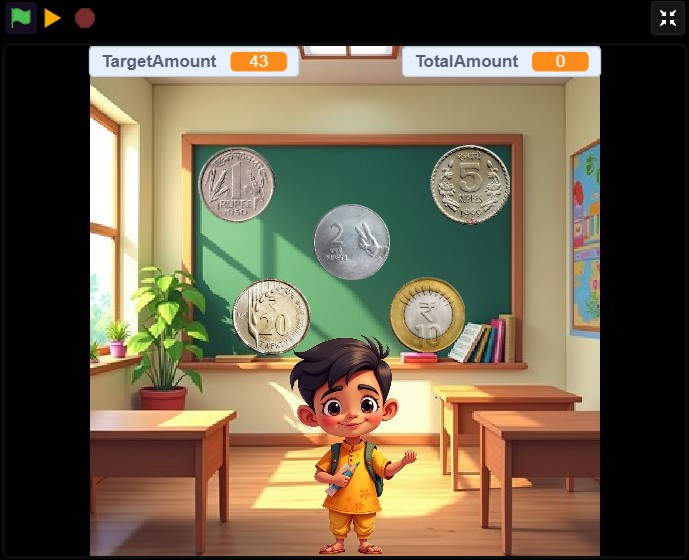

# Counting Coins – Scratch Math Game for Kids (₹1,₹2, ₹5, ₹10, ₹20)

🎮 **Play & Learn Math with Coins!**  
This Scratch project is a fun, interactive game designed to help children aged 6–10 practice simple **addition** using Indian rupee coins.

---

## 🔢 Game Features:
- Drag and click ₹1, ₹5, ₹10, ₹20 coins to match the target amount
- Encouraging cartoon-style Indian character (AI-generated)
- Designed with child-safe visuals and cheerful animations
- Targeted for early learners and math beginners

---

## 👇 How to Use:
1. Click the green flag to start the game
2. A random **target amount** is shown
3. Click on coins to match the amount
4. You'll be encouraged or guided if it's too much or matched correctly

---

## 🛠️ Built With:
- Scratch 3.0
- Images from Google (coins)
- Character and background made using **Leonardo AI**

---

## 🤖 About the Creator:
I’m a beginner passionate about learning and helping kids learn with fun.  
I created the idea, designed the experience, and coded the game myself.  
AI tools were used for visual help only.

---

## 📷 Screenshot:

---

### 🔗 Shareable Tags:
`Scratch math game` · `counting coins` · `kids game Scratch` · `Indian rupee Scratch game` · `learn addition Scratch` · `educational Scratch game` · `child-friendly coding project`

